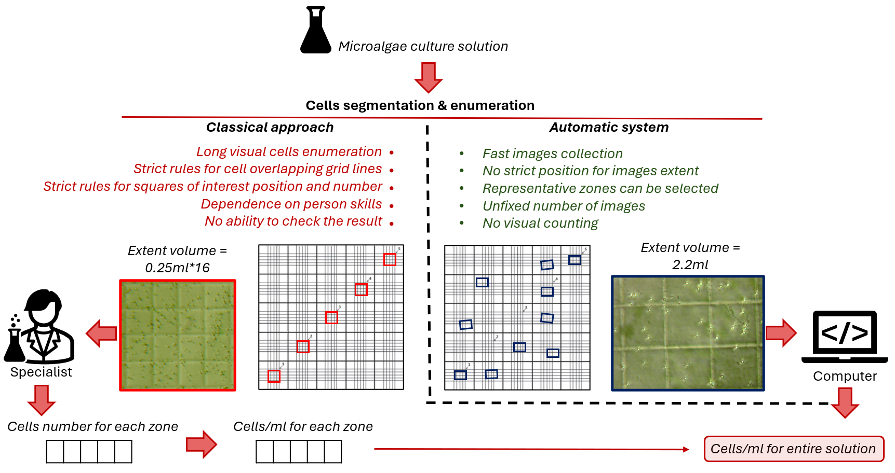
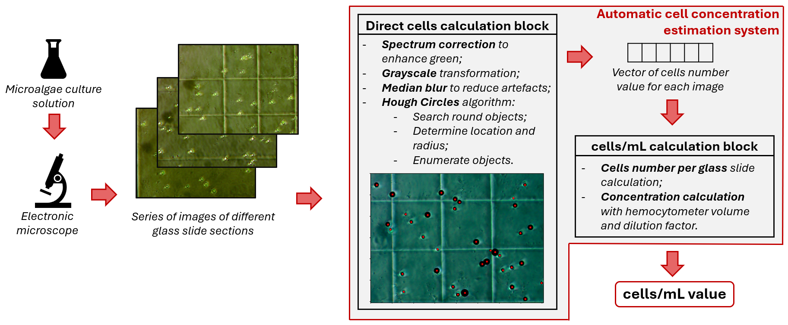
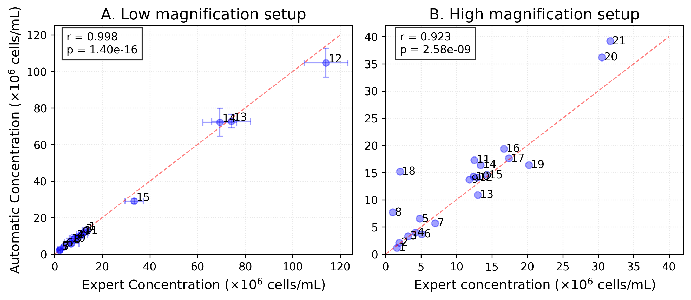
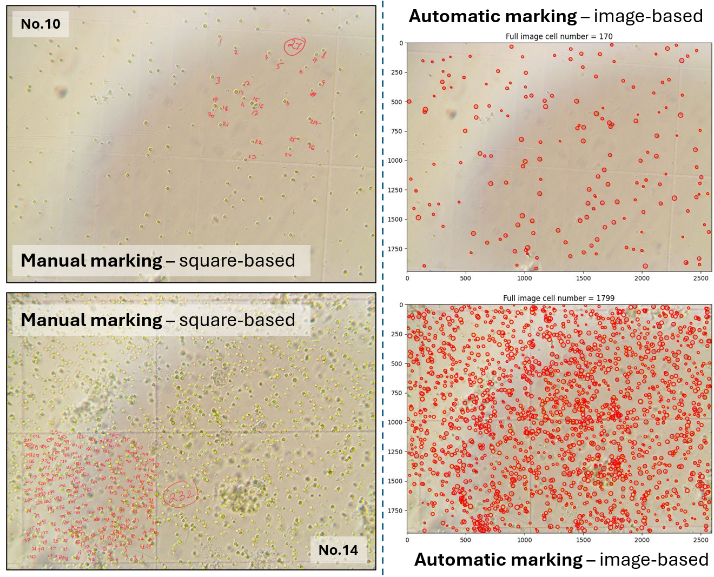

# Low-cost Microalgae Cell Concentration Estimation in Hydrochemistry Applications Using Computer Vision

---


[](https://github.com/aimclub/OSA)

Built with:


---

## Overview

This work presents a cost-effective and efficient method for automated microalgae cell concentration estimation, offering an alternative to traditional manual counting and expensive automated systems. It directly addresses the need for rapid and reliable biomass quantification in algal research and biotechnology. The core approach utilizes classical computer vision techniques, notably the Hough Circle Transform, to segment and count cells from microscopic images, calculating concentrations based on chamber geometry. Validation against expert hemocytometer counts demonstrates strong correlation and significant time savings. This implementation supports the findings of associated research by providing a reproducible open-source tool for automated cell concentration analysis.

---

## Table of Contents

- [Content](#content)
- [Algorithms](#algorithms)
- [Installation](#installation)
- [License](#license)
- [Citation](#citation)

---
## Content

This project focuses on estimating microalgae cell concentration, comparing automated image analysis with manual expert annotation. It incorporates a data processing pipeline for microscopic images, including preprocessing steps like contrast enhancement and filtering. A core component is an automated segmentation module utilizing classical computer vision—specifically circle detection—to identify and count cells. The system calculates concentrations based on these counts and chamber geometry, validating results against manually obtained values.  A deep learning-based segmentation model (U-Net) is also implemented for comparative analysis. The project delivers tools for visualizing concentration estimates and assessing the accuracy of automated methods relative to expert assessments, aiming for a cost-effective alternative to traditional counting techniques.

---

## Algorithms

This project employs a computer vision pipeline for automated microalgae cell concentration estimation. A key technique is the Hough Circle Transform, used to identify and locate individual cells within microscopic images without requiring extensive training data. Image preprocessing steps like spectrum correction and median blur filtering enhance image quality for accurate circle detection. Concentration calculation leverages chamber geometry and detected cell counts to estimate cells per milliliter.  A U-Net convolutional neural network architecture is also implemented for segmentation, offering an alternative approach to identifying cells within images. Finally, statistical analysis—including Pearson correlation coefficients—validates the automated method against manual counting.

<p align="center">

</p>

Scheme of proposed automated approach:

<p align="center">

</p>

---

## Results

Statistical comparison revealed strong agreement between expert and automated cell 
counting methods:

<p align="center">

</p>

Examples of manual and automated processing (low magnification):

<p align="center">

</p>

---

## Installation

Install microalgae_conc using one of the following methods:

**Build from source:**

1. Clone the microalgae_conc repository:
```sh
git clone https://github.com/ITMO-NSS-team/microalgae_conc
```

2. Navigate to the project directory:
```sh
cd microalgae_conc
```

3. Install the project dependencies:

```sh
pip install -r requirements.txt
```

---

## License

This project is protected under the BSD 3-Clause "New" or "Revised" License. For more details, refer to the [LICENSE](https://github.com/ITMO-NSS-team/microalgae_conc/tree/main/LICENSE) file.

---

